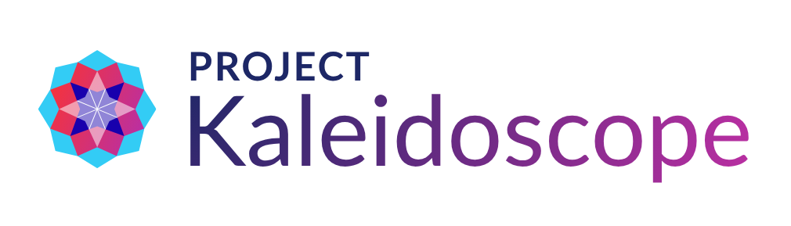
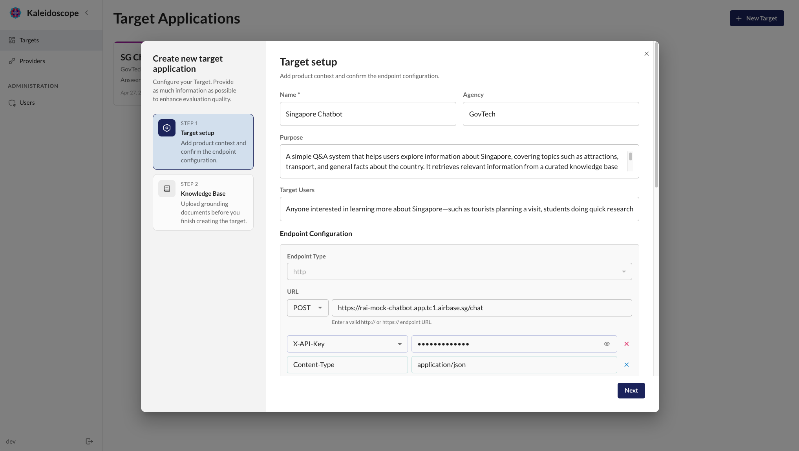
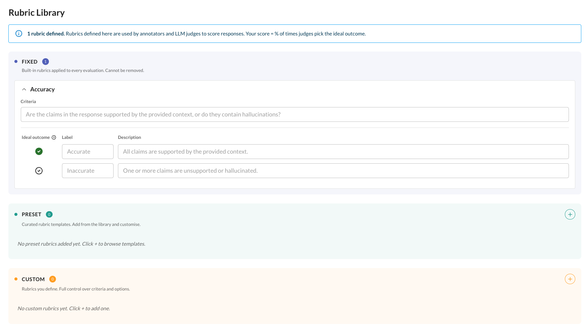
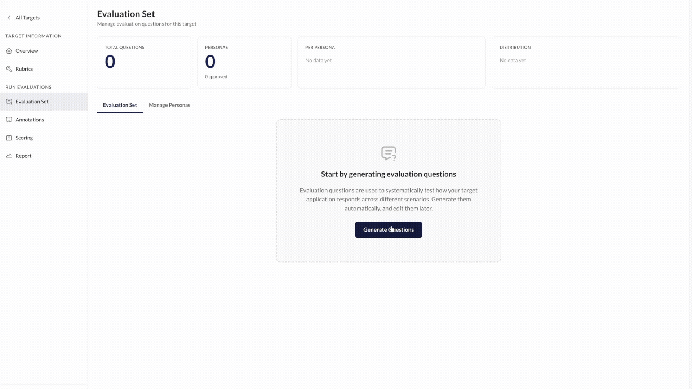
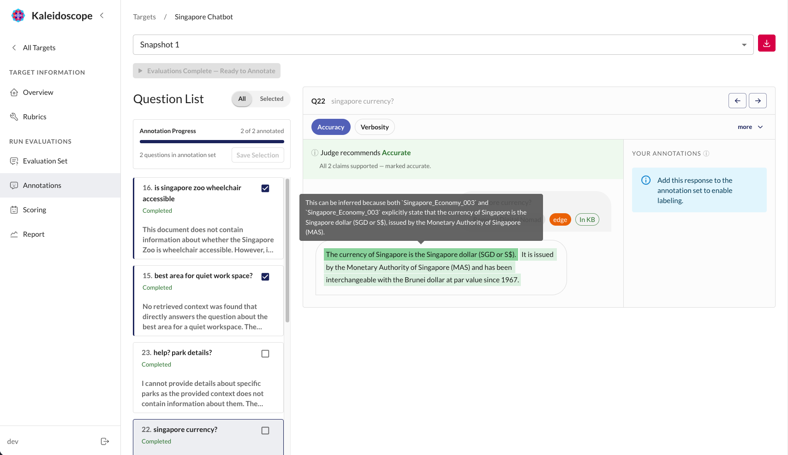
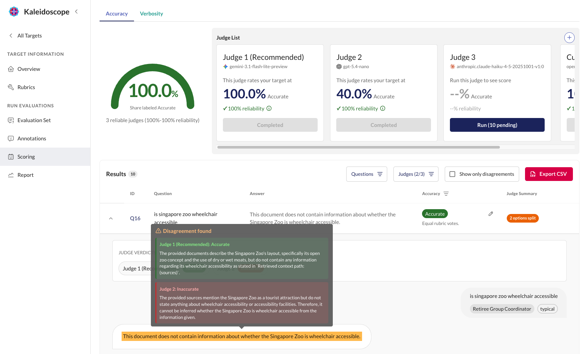

<div align="center">



Automated evaluation platform for AI-powered applications. Generate diverse test inputs and score the responses with LLM judges evaluated for reliability.

</div>

## 🤖 LLM Quickstart

For both setup and development, direct your agent to **[`AGENTS.md`](AGENTS.md)**.

## 👶 Human Quickstart

```bash
git clone https://github.com/govtech-responsibleai/kaleidoscope.git

cd kaleidoscope
cp .env.example .env          # add your LLM API key — see [Providers](#providers)

docker compose up -d   # log in: dev / dev
```

Head to `http://localhost:3000 ` to view your app.

A default admin user (`dev` / `dev`) is created on first startup. Add more users via the admin panel once logged in.

## 🔭 What can you do with Kaleidoscope?



**Connect any LLM application** — point Kaleidoscope at any HTTP endpoint. Your chatbot, RAG pipeline, or custom API becomes the evaluation target with no code changes required.



**Define custom rubrics** — write scoring criteria tailored to your use case. Evaluate dimensions like accuracy, tone, safety, or any domain-specific quality you care about.



**Generate diverse evaluation questions** — create user personas with Singapore contextualisation and generate realistic questions across types (typical/edge) and scopes (in-KB/out-of-KB).



**Annotate with judge assistance** — claims and full responses are highlighted with judge reasoning. Human annotation in one click.



**Measure judge reliability** — evaluate answers with multiple LLM judges for comparison. Judge reliability is calculated from human annotations. Only reliable judges contribute to aggregated scores.


## 🔌 Providers

Kaleidoscope uses **LiteLLM** — any provider LiteLLM supports works out of the box. Add the relevant key to `.env` and you're set:

| Provider | Env var |
|----------|---------|
| Gemini | `GEMINI_API_KEY` |
| OpenAI | `OPENAI_API_KEY` |
| Anthropic | `ANTHROPIC_API_KEY` |
| Azure OpenAI | `AZURE_API_KEY` + `AZURE_API_BASE` |
| AWS Bedrock | `AWS_BEARER_TOKEN_BEDROCK` |
| OpenRouter | `OPENROUTER_API_KEY` |
| Fireworks | `FIREWORKS_AI_API_KEY` |

Default models and the full list live in [`backend/src/common/llm/provider_catalog.yaml`](backend/src/common/llm/provider_catalog.yaml) — add your own there.

## 🛠️ Local Development

**Stack**: FastAPI + SQLAlchemy + LiteLLM (Python 3.13, uv) · Next.js 16 + React 19 + MUI v7 (TypeScript) · PostgreSQL

**Non-dev / full stack:**
```bash
git clone https://github.com/govtech-responsibleai/kaleidoscope.git
cd kaleidoscope
docker compose up -d
```

**Dev (recommended):**
```bash
docker compose up -d db backend   # db + backend in Docker
cd frontend && npm run dev         # frontend locally with hot reload
```

| Service | URL |
|---------|-----|
| Frontend | http://localhost:3000 |
| Backend API | http://localhost:8000 |
| API docs | http://localhost:8000/docs |

Docker reference: [DOCKER.md](DOCKER.md)  
Subsystem docs: [Backend](backend/README.md) | [Frontend](frontend/README.md)

## 🚀 Deployment

Configure your images in [`docker-compose.yml`](docker-compose.yml) and the [`backend/Dockerfile`](backend/Dockerfile) / [`frontend/Dockerfile`](frontend/Dockerfile).

**Before deploying to production** rotate the dev secrets to strong random values:

```bash
# Run twice — once for JWT_SECRET_KEY, once for ADMIN_API_KEY
cd backend && uv run python scripts/generate_secret.py
```

Set the outputs in `.env` or your deployment environment.

> **Nemotron dataset**: The first call to sample Nemotron personas downloads NVIDIA's [Nemotron-Personas-Singapore](https://huggingface.co/datasets/nvidia/Nemotron-Personas-Singapore) dataset (~148K rows) and caches it to `~/.cache/huggingface/`. Expect time and disk on first run — subsequent calls are instant.

## 🇸🇬 WOG? Read on.

Kaleidoscope supports [AIBots](https://aibots.gov.sg). AIBots access requires government credentials.

**Enable the extension:**
```bash
# .env
KALEIDOSCOPE_EXTENSIONS=aibots
```

You now select "aibots" during Target Application set-up. More connectors coming soon!

Full connector reference: [`backend/src/extensions/aibots/README.md`](backend/src/extensions/aibots/README.md)

Reach out to the **AI Practice** team for setup details.

## 📄 License

MIT